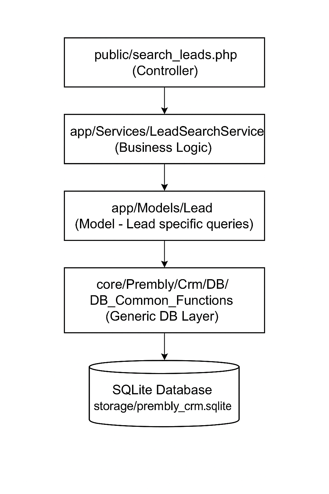

# CRM Lead Search Refactor

This repo demonstrates how to refactor a legacy codebase in `task/search_leads.php` into a **clean controller + service + views** architecture with **modern PHP** practices.

## 1. Refactoring Overview

I applied a clear separation of concerns so that business logic, database access, and presentation layers are independent and maintainable.

1. **Business Logic Layer** (`app/Services`)

- `LeadSearchService.php` in `app/Services/` contains all the application-level logic for searching leads.

- It handles:
  - Constructing queries
  - Interacting with database helper classes (`DB_Common_Functions`)
  - Returning results in a neutral data format (arrays or objects)

This ensures that no database logic is mixed into the views. 2. **Data Access Layer (Models & DB Utilities)**

- `app/Models/Lead.php` (Lead-specific queries) - To hndle queries on the leads table — it contains all SQL for searching and counting leads, and inserting the leads search logs.
- `core/Prembly/Crm/DB/DB_Common_Functions.php` (generic DB helpers) - abstracts generic PDO operations (preparing statements, which could be extended) so they can be reused by other models.

- `core/Prembly/Crm/Utils/Common_Utilities.php` - To provides reusable utility methods (e.g., param parsing, escape helpers, string formatting, etc).

- These files **never handle HTML output** or direct user input — they just talk to the database and as helpers. These classes are **framework-agnostic** and can be reused in other projects.

3. Configuration Layer (`config/db.php`)

- Stores database connection details (in this case, SQLite file path).

- Centralized config so credentials and connection logic are not hardcoded in services.

4. Presentation Layer (`app/views`)

- `layout.php` – Main HTML layout template.

- `partials/` – Smaller reusable view components:

  - `pagination_view.php` – Displays pagination controls.

  - `search_results_view.php` – Displays the search results table.

- These files **only contain HTML/PHP for rendering data** — no database or business logic.

5. Public Entry Point (`public/search_leads.php`)

- Acts as the **controller**:

  - Reads HTTP request parameters (`$_GET`).
  - Calls `LeadSearchService` to retrieve leads.
  - Passes the data to the correct view templates.

- Keeps the HTTP handling separate from both database and rendering.

With this architecture:

- **No SQL in the presentation layer** — all database logic lives in models.
- **No HTML in the business logic** — services just return data arrays/objects.
- **Models don’t know about the UI** — they can be reused in APIs, cron jobs, or tests.
- **Service layer bridges models & views** — encapsulating the workflow and rules.

### Flow Diagram



This now clearly shows:

- **Controller** (`search_leads.php`) handling HTTP requests and responses
- **Service Layer** (`LeadSearchService`) containing business logic
- **Model Layer** (`Lead.php`) containing domain-specific data access methods
- **DB Layer** (`DB_Common_Functions`) with generic database helpers
- **Views** for the presentation layer

### Benefits

- **Easier Maintenance** – Changing how leads are retrieved doesn’t affect the views.
- **Reusability** – The service and core utilities can be reused in CLI scripts, APIs, or other apps.
- **Testability** – Business logic can be unit tested without rendering HTML.
- **Cleaner Code** – Views focus solely on output, services focus solely on logic.

## 2. Implementation of the New “Company Name” Search Feature

The refactored architecture made the process of adding `Company Name` as a new search criterion straightforward because the search logic, data access, and presentation layer were already cleanly separated.

**Where the change was made**

1. **Update the Search Form (Presentation Layer)**
   In search-leads-view.php (front-end form), we simply added a new <option> value:

```html
<option value="company_name">Company Name</option>
```

This should be the only change needed in the view layer.

2. **Uodated Lead.php (Data Layer)**

I simply added:

```php
public function searchLeadsByCompanyName(string $text, int $ownerId): array
{
    return $this->searchLeads("company_name", $text, $ownerId);
}
```

and

```php
public function searchLeadsByCompanyNameWithOffset(string $text, int $ownerId, int $offset): array
{
    return $this->searchLeads("company_name", $text, $ownerId, $offset);
}
```

No need to touch raw SQL in multiple places — the generic `searchLeads()` method handles everything.

3. **Added Logic in LeadSearchService (Business Logic Layer)**
   Since `LeadSearchService` acts as the single entry point for all search requests:

   - I added a new match `branch` in `getLeads()`:

     ```php
     'company_name' => 'searchLeadsByCompanyName',
     ```

   - In the `getSearchCriteriaText()` method, I just added:

     ```php
     'company_name' => 'Company Name'
     ```

   - The `search()` method already handled generic input sanitization, pagination, and logging, so no extra logic was needed for those parts.

**Why it was easy after the refactor**

In the legacy `task/search_leads.php` spaghetti code:

- SQL queries were scattered across the controller script.
- To add "Company Name", I would have had to:
  - Add another `switch` branch.
  - Manually duplicate and edit SQL queries.
  - Handle pagination logic again.
  - Update multiple HTML templates to match the new search type.
- This meant **more code duplication**, higher risk of typos, and inconsistent behavior.

In the **refactored version**:

  - **Single source of truth**: All search logic is in `Lead.php` in one reusable method (`searchLeads()`).
  - **DRY principle**: No repeated SQL — just pass a new field name to the generic method.
  - **Presentation untouched**: The view templates and controllers didn’t need to change at all.
  - **Lower testing overhead**: I only needed to confirm that the new parameter was passed correctly, since pagination and sorting already worked.

**The Bottom line**

Thanks to the refactor, adding a new search criterion was just **2–3 small edits** in one class, rather than surgery on a fragile procedural script.
In other words:

> *Before*: 20–30 minutes of copy-paste and debug.
> *Now*: 5 minutes and zero spaghetti sauce.

## 3. Security Vulnerabilities && Modernization

### Security Vulnerabilities in Legacy Code

1. **Direct Use of `$_REQUEST` Without Proper Validation**

    - **Problem**:
     The old code used `$_REQUEST` directly (e.g., `$_REQUEST['searchText']`, `$_REQUEST['searchValue']`) in SQL calls through `$comm_func` methods.
    Even though `$util->sanitize_html()` was sometimes used, HTML sanitization does not protect against SQL injection — it’s designed for XSS, not database security.
    - **Risk**:
     An attacker could inject SQL payloads via search parameters (`searchText`, `searchValue`), potentially exposing or manipulating data.
     - **Solution**:
      In the refactored Lead model and LeadSearchService, database queries now use prepared statements with bound parameters.
      **Impact**:
        - Eliminates SQL injection risk.
        - No need for manual SQL string concatenation.

2. **No CSRF Protection**

    - **Problem**:
    The legacy code allowed state-changing requests (e.g., storing agent search logs) without verifying if the request came from an authenticated, trusted source.

    - **Risk**:
    An attacker could trick an authenticated agent into performing unintended actions via a crafted link or form submission.

    - **Solution**:
      - The refactored code passes all input parameters (`$_REQUEST`) into the `LeadSearchService::search()` method.
      - The service sanitizes and validates only what’s needed, with strict type handling (`declare(strict_types=1)`).
      **Impact**:
        - Reduces risk of tainted data flowing into queries or views.
        - Easier to maintain input validation logic.

3. **Inconsistent Output Escaping**

    - **Problem**:
      Data from the database (like `$lead->email` or `$lead->city`) was echoed directly into HTML without escaping.

    - **Risk**:
      If malicious data made its way into the database, it could trigger **stored XSS** when rendered.

    - **Solution**
      The new `public/search_leads.php` generates and stores a CSRF token in `$_SESSION['csrf_token']`.
      **Impact**:
        - Prevents cross-site request forgery attacks for any POST requests (and could be extended to search logging).
        - Token can be embedded in forms and verified before processing requests.

### Modernization Efforts

**Strict typing**: `declare(strict_types=1);` ensures parameters and returns match expected types.

Short array syntax: Replaced `array()` with `[]` for better readability.

**Null coalescing operator** (??):
Example:
```php
$agentId = $_SESSION['admin_id'] ?? 0;
```

replaces verbose `isset()` checks.

**Dependency injection**:

  - `$pdo` is injected into the Lead model.
  - Business logic is isolated in `LeadSearchService`.

**Separation of concerns**:

  - Controller (`public/search_leads.php`) only orchestrates request handling and view rendering.
  - Service layer handles the search logic.
  - Model layer handles database queries.

**Performance**:
  - `COUNT(*)` pagination instead of counting the returned results 
  - indexed search fields recommended (`fname`, `email`, `mainPhone`, ...)

**Scalability & maintainability (Introduction of PSR-4 namespaces for class organization and autoloading)**:
If your project grows to dozens or hundreds of classes, namespaces make it easy to avoid collisions and maintain logical grouping.
  - Legacy procedural PHP often dumped all functions/classes into the global namespace, which can cause **naming conflicts**.
  - Namespaces were introduced in PHP 5.3 (2009) and are now standard in professional, maintainable PHP applications.
  - **Improved code organization** - the refactoring maps cleanly to namespaces to make clear where a class belongs and its purpose
    ```php
    namespace App\Services;
    namespace App\Models;
    namespace Prembly\Crm\DB;
    namespace Prembly\Crm\Utils;
    ```
  - **Better autoloading** - With namespaces and PSR-4 autoloading (via Composer or your custom autoloader), you avoid the require/include spaghetti from the legacy code.
  **Example**:
    ```php
    use App\Services\LeadSearchService
    ```
    cleanly imports the class without manually including its file.

## Getting Started

1. PHP 8.1+ recommended.
2. Copy files to your environment.
3. (Demo) Initialize SQLite DB:
   ```sql
   -- Run this SQL in a SQLite shell to create sample data
   CREATE TABLE leads (
      id INTEGER PRIMARY KEY AUTOINCREMENT,
      real_date TEXT NOT NULL,
      full_name TEXT,
      fname TEXT,
      lname TEXT,
      mainPhone TEXT,
      secondPhoneArea TEXT,
      secondPhone TEXT,
      sex TEXT CHECK(sex IN ('Male', 'Female', 'Other')),
      email TEXT,
      city TEXT,
      state TEXT,
      name TEXT,
      current_status TEXT,
      owner_id INTEGER,
      crm_id TEXT,
      mkt_id TEXT
   );
   INSERT INTO leads (
    real_date, full_name, fname, lname, mainPhone, secondPhoneArea, secondPhone,
    sex, email, city, state, name, current_status, owner_id, crm_id, mkt_id
    ) VALUES
   ('2025-08-10', 'John Doe', 'John', 'Doe', '08031234567', '0803', '1234567','Male', 'john.doe@example.com', 'Lagos', 'Lagos', 'Main Office', 'Active', 1, 'CRM001', 'MKT001'),
   ('2025-08-09', NULL, 'Jane', 'Smith', '08123456789', '', '',
   'Female', 'jane.smith@example.com', 'Abuja', 'FCT', 'Branch Office', 'Prospect', 2, 'CRM002', 'MKT002'),
   ('2025-08-08', 'Michael Johnson', 'Michael', 'Johnson', '07061234567', '0706', '9876543', 'Male', 'michael.j@example.com', 'Port Harcourt', 'Rivers', 'Regional, Office', 'Closed', 1, 'CRM003', 'MKT003'),
   ('2025-08-07', NULL, 'Fatima', 'Bello', '09021234567', '', '', 'Female', 'fatima.bello@example.com', 'Kano', 'Kano', 'North Office', 'Active', 3, 'CRM004', 'MKT004');
   ```
   Save the DB file as `storage/prembly_crm.sqlite` relative to the project root.
4. Run with PHP's built-in server:
   ```bash
   php -S localhost:8000 -t public
   ```
5. Open `http://localhost:8000/search_leads.php`

## Adapting to MySQL

Edit `config/db.php`:

```php
return [
  'dsn' => 'mysql:host=127.0.0.1;dbname=crm;charset=utf8mb4',
  'user' => 'crm_user',
  'pass' => 'secret',
];
```

Ensure indexes:

```sql
CREATE INDEX idx_leads_name ON leads(fname);
CREATE INDEX idx_leads_name ON leads(lname);
CREATE INDEX idx_leads_email ON leads(email);
CREATE INDEX idx_leads_phone ON leads(mainPhone);
```

## Folder Structure

```
prembly-crm-refactor/
├── app/
│   ├── Models/
│   │   └── Lead.php
│   ├── Services/
│   │   └── LeadSearchService.php
│   └── views/
│       ├── layout.php
│       └── partials/
│           ├── pagination_view.php
│           └── search_results_view.php
├── config/
│   └── db.php
├── core/
│   └── Premply/
│       └── Crm/
│           ├── DB/
│           │    └── DB_Common_Functions.php
│           └── Utils/
│               └── Common_Utilities.php
├── public/
│   └── search_leads.php
├── storage/
│   └── prembly_crm.sqlite
├── autoload.php
└── README.md
```

## Future Improvements

- Add unit tests (PHPUnit) and contract tests for external integrations.
- Extract pagination into a reusable component.
- Add authentication & role-based access to the page.
- Implement CSRF validation for state-changing endpoints.
- Introduce a ViewModel or templating engine (e.g., Twig) for even cleaner views.
- Introduce enviroment variable (`.env`) for app sensitive settings like database credentials, against hardcording in the config.
- Use `.gitignore` to prevent development files from being pushed to `git`.
